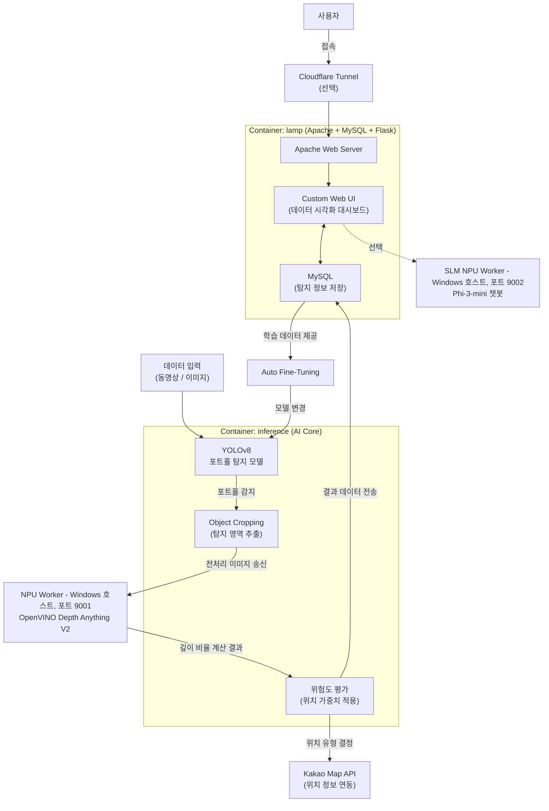

# Deep-Guardian — 포트홀 탐지 및 모니터링 시스템

YOLOv8로 도로 포트홀을 실시간 탐지하고, OpenVINO 기반 Depth Anything V2로 깊이를
검증한 뒤, 위치 기반 위험도를 매겨 지도/대시보드로 보여주는 AI 시스템입니다.

## 아키텍처

2개의 Docker 컨테이너(추론 + LAMP 웹서버)로 구성됩니다. 자세한 원본 블록도는
[`docs/references/`](docs/references/)의 발표자료를 참고하세요.



- **inference / lamp / cloudflared** — `docker-compose.yml`로 함께 뜨는 컨테이너입니다. `lamp` 컨테이너 안에 Apache·MySQL·Flask가 전부 들어있습니다.
- **NPU Worker / SLM NPU Worker(Phi-3 챗봇)** — Windows 호스트에서 **별도로 직접 실행**해야 합니다(컨테이너 밖). `inference` 컨테이너는 `host.docker.internal`로 이 둘을 호출합니다.

## 빠른 시작

```powershell
# 1. 환경 변수 설정
copy .env.example .env
# .env를 열어 GEMINI_API_KEY 등을 채워 넣으세요.

# 2. Docker 컨테이너 시작
docker-compose up -d --build

# 3. 기본 사용자 생성
docker exec -it deep-guardian-lamp python3 /var/www/app/create_default_users.py

# 4. NPU Worker 시작 (별도 PowerShell 창, Windows 호스트에서)
.\start_npu_worker.ps1

# 5. (선택) Phi-3 챗봇 워커 시작 (별도 PowerShell 창)
.\start_phi3_worker.ps1
```

접속: http://localhost · 기본 계정 `admin`/`admin123`, `user`/`user123` — **운영 환경에서는 반드시 변경하세요.**

## 기술 스택

| 영역 | 기술 |
|---|---|
| 탐지 모델 | YOLOv8n (Ultralytics, PyTorch) |
| 깊이 검증 | Depth Anything V2 + OpenVINO (NPU 가속) |
| 챗봇 / 요약 | Phi-3-mini(OpenVINO GenAI), Google Gemini |
| 백엔드 | Django ORM, Flask |
| 데이터베이스 | MySQL |
| 위치 정보 | Kakao Map API |
| 인프라 | Docker Compose, Apache(+mod_wsgi), Cloudflare Tunnel |

## 문서

전체 문서 목록은 [`docs/INDEX.md`](docs/INDEX.md)에 있습니다. 주요 항목:

- [`docs/PROJECT_HISTORY.md`](docs/PROJECT_HISTORY.md) — 아키텍처가 지금 형태로 정착하기까지의 변천사
- [`docs/references/`](docs/references/) — 팀 발표자료(공식 아키텍처 블록도), 관련 연구 논문
- [`edge-ai/`](edge-ai/) — 학습된 모델을 엣지 기기(라즈베리파이 등)에 배포하기 위한 별도 실험 — 메인 시스템과는 아직 통합되지 않음
- [`archive/`](archive/) — 이전에 메인이었던 PostgreSQL 5-컨테이너 구조 등 지금은 쓰지 않는 코드

## ⚠️ 알려진 제한사항

- 기본 관리자 계정(`admin`/`admin123`)은 개발 편의용입니다. 운영 전 반드시 변경하세요.
- NPU Worker / SLM NPU Worker는 Docker 컨테이너가 아니라 Windows 호스트에서 직접 실행해야 합니다.
- `archive/`와 `edge-ai/`는 현재 운영 파이프라인의 일부가 아닙니다(각 폴더의 README 참고).

## 라이선스

별도 명시가 없는 한 이 저장소의 코드는 학습/포트폴리오 목적입니다.
